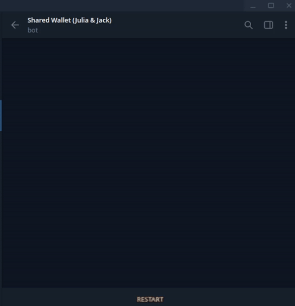
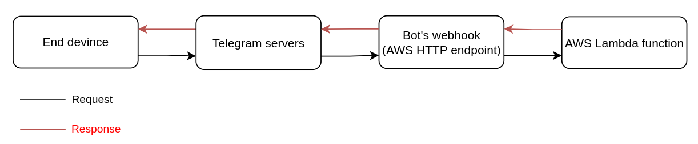

# Shared wallet telegram bot (serverless)
This is a simple Telegram bot that allows you to create a shared wallet with your friend. In other words, 
if you lend/borrow some money to/from someone, you'd want to keep an eye on how much each person owes the other.
This bot does this accounting for you.

This Telegram bot is serverless, meaning that it doesn't require a server to run it. Amazon AWS lambda functions 
power the execution, hence it is extremely cost-effective (maybe even a few cents per months).



## How does the bot work?
Since there is no dedicated server involved, the bot functions with webhook. The address of the hook
is an HTTP endpoint of the AWS lambda function.


## How to create your own bot
The infrastructure of this bot is handled by Terraform and GitHub actions. To create your own bot, follow these steps:
1. Make sure you have an AWS account.
2. Create a new Telegram bot using the [BotFather](https://core.telegram.org/bots/tutorial).
3. Clone this repository, and navigate to the `terraform/remote-state` directory.
4. Export your AWS credentials as environment variables:
```
export AWS_ACCESS_KEY_ID=your_aws_access_key_id
export AWS_SECRET_ACCESS_KEY=your_aws_secret_access_key
```
5. Perform `terraform init && terraform apply` to create the remote state bucket.
6. Add an [environment](https://docs.github.com/en/actions/deployment/targeting-different-environments/using-environments-for-deployment) to your GitHub repository with the following secrets:
- `BOT_TOKEN`: The token you received from the BotFather.
- `USER1`: Username and Chat ID of of user1 sperated by a comma. For example: `Julia,12345`.
- `USER2`: Username and Chat ID of of user2 sperated by a comma. For example: `Jack,54321`.
- `WALLET1`: Currency and symbol of wallet1 separated by a comma. For example: `Dollar,$`.
- `WALLET2`: [Optional] Currency and symbol of wallet2 separated by a comma. For example: `Euro,€`.
- `WALLET3`: [Optional] Currency and symbol of wallet3 separated by a comma. For example: `Toman,T`.

7. Add the name of the environment that you added in `.github/workflows/tf-apply.yml` and `.github/workflows/tf-destroy.yml` files.
8. Run the GitHub workflow to create the infrastructure on AWS.
9. Go to your Telegram bot and start chatting with it!

## Side notes
- You may create as many wallets as you have defined in the environment!
- Only the two users which were defined in the environment (based on their chat IDs) can add transactions to the wallet. When a user updates a wallet, the other user gets notified by the bot.
